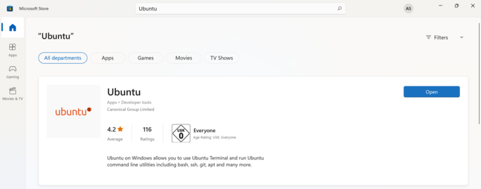

# WSL2

The Windows Subsystem for Linux enables you to run a GNU/Linux environment on Windows, without a virtual machine or dualboot setup. WSL2 also runs a Linux Kernel.

**For Windows 11:** 
Click the Windows logo on the bottom left of your home screen and search for `Turn Windows features on or off`. 
Check the box on `Virtual Machine Platform` and `Windows Subsystem for Linux`. You will then be asked to restart your device.


Click on the Windows logo again and search for `command prompt`. Then right-click on it and select `open as administrator`. 

Type the line below in the command prompt.

```shell
wsl --install
```

Download Ubuntu from the Microsoft store and chose your prefered version.



After the download is complete, start Ubuntu by clicking on the symbol.

You'll be asked to create a password and username. The password will be hidden when you type it, just press enter when you have finished typing. After that, enter the lines below in Ubuntu. 

```bash
sudo apt update
sudo apt upgrade
```

Your WSL2 is now setup, happy coding!

### More help
If none of this works for you or you have other problems, check out [this guide](https://www.ceos3c.com/wsl-2/install-wsl2-with-windows-terminal/) or contact one of the authors. 

### Authors
[**Anna Stein**](https://slam.phil.hhu.de/authors/anna/)
[**Akhilesh Kakolu Ramarao**](https://slam.phil.hhu.de/authors/akhilseh/)
