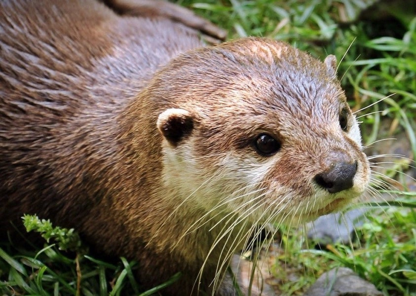

---
# Display name
title: Jennifer C. White

# Username (this should match the folder name)
authors:
- jen

# Is this the primary user of the site?
superuser: false

# Role/position
role: PhD Student

# Organizations/Affiliations
organizations:
- name: University of Cambridge
  url: "https://www.cam.ac.uk/"

# Short bio (displayed in user profile at end of posts)
bio: PhD student at the University of Cambridge

interests:
- low-resource NLP
- linguistic annotation

# Social/Academic Networking
# For available icons, see: https://sourcethemes.com/academic/docs/widgets/#icons
#   For an email link, use "fas" icon pack, "envelope" icon, and a link in the
#   form "mailto:your-email@example.com" or "#contact" for contact widget.
social:
- icon: envelope
  icon_pack: fas
  link: "mailto:jw2088@cam.ac.uk"
- icon: twitter
  icon_pack: fab
  link: https://twitter.com/JenniferCWhite
- icon: github
  icon_pack: fab
  link: https://github.com/jennifercw
- icon: portrait
  icon_pack: fas
  link: "https://jennifercw.github.io/"
  
# Link to a PDF of your resume/CV from the About widget.
# To enable, copy your resume/CV to `static/files/cv.pdf` and uncomment the lines below.  
# - icon: cv
#   icon_pack: ai
#   link: files/cv.pdf 

# Enter email to display Gravatar (if Gravatar enabled in Config)
email: ""
  
# Organizational groups that you belong to (for People widget)
#   Set this to `[]` or comment out if you are not using People widget.  
user_groups:
- Members
---
Jennifer is a first-year PhD student at the [University of Cambridge](https://www.cam.ac.uk/), supervised by Ryan. She earned an MMathPhys in Mathematics and Physics at the University of Warwick and an MPhil in Advanced Computer Science at the University of Cambridge where she was also supervised by Ryan. She is interested in techniques for low-resource NLP, gender bias in NLP and annotation of linguistic data, among other things. Her background is in Algebraic Geometry, so she is always happy to get a chance to put her mathematical skills to good use. In her spare time she enjoys learning languages, reading, eating chicken katsu curry and travelling as much as possible.

Native Language: English

Animal Form: Otter

