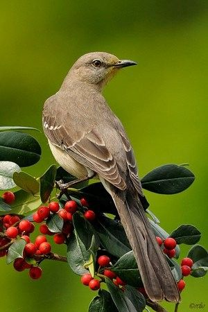

---
# Display name
title: Ekaterina Vylomova
secondary: Екатерина Выломова

# Username (this should match the folder name)
authors:
- kat

# Is this the primary user of the site?
superuser: false

# Role/position
role: Postdoctoral Researcher

# Organizations/Affiliations
organizations:
- name: University of Melbourne
  url: "https://www.unimelb.edu.au/"

# Short bio (displayed in user profile at end of posts)
bio: 

interests:
- computational morphology
- computational typology
- low-resource NLP
- diachronic LMs
- linguistic annotation

# Social/Academic Networking
# For available icons, see: https://sourcethemes.com/academic/docs/widgets/#icons
#   For an email link, use "fas" icon pack, "envelope" icon, and a link in the
#   form "mailto:your-email@example.com" or "#contact" for contact widget.

social:
- icon: envelope
  icon_pack: fas
  link: "mailto:ekaterina.vylomova@unimelb.edu.au"  # For a direct email link, use "mailto:test@example.org".
- icon: twitter
  icon_pack: fab
  link: https://twitter.com/ivrik
- icon: google
  icon_pack: fab
  link: https://scholar.google.com/citations?user=JlVHhVUAAAAJ&hl=en
- icon: github
  icon_pack: fab
  link: https://github.com/ivri
- icon: portrait
  icon_pack: fas
  link: "http://kat.academy/"

# Enter email to display Gravatar (if Gravatar enabled in Config)
email: ""
  
# Organizational groups that you belong to (for People widget)
#   Set this to `[]` or comment out if you are not using People widget.  
user_groups:
- Frequent Collaborators
---

Ekaterina Vylomova is a Postdoctoral Fellow at the University of Melbourne. She holds a PhD in Computer Science obtained from the University of Melbourne. Her research is focused on compositionality modelling for morphology, models for derivational morphology, neural machine translation, and diachronic language modeling. 

Native Language: Russian

Animal Form: Mimus polyglottos

