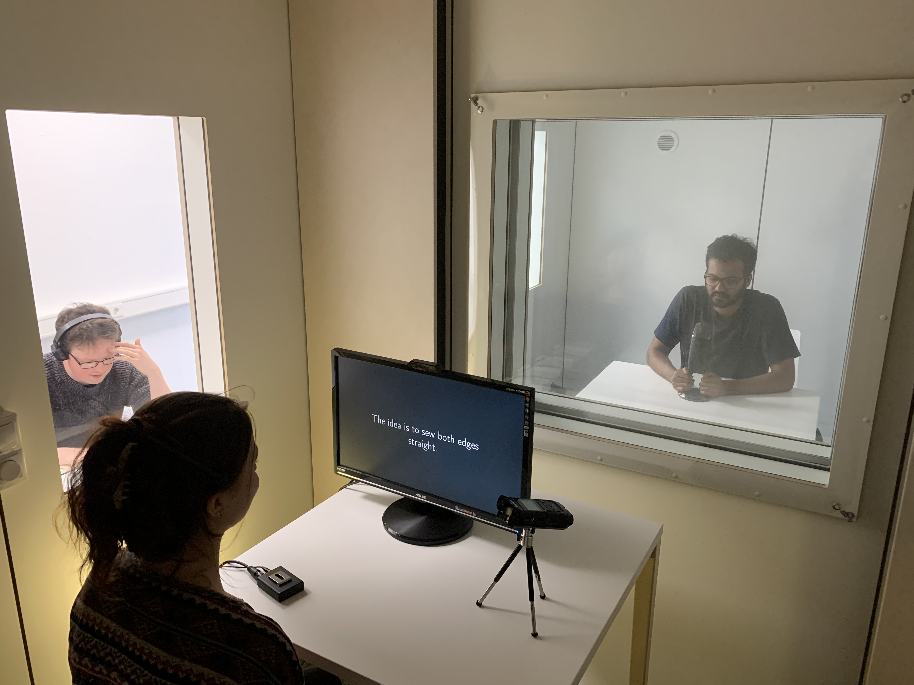
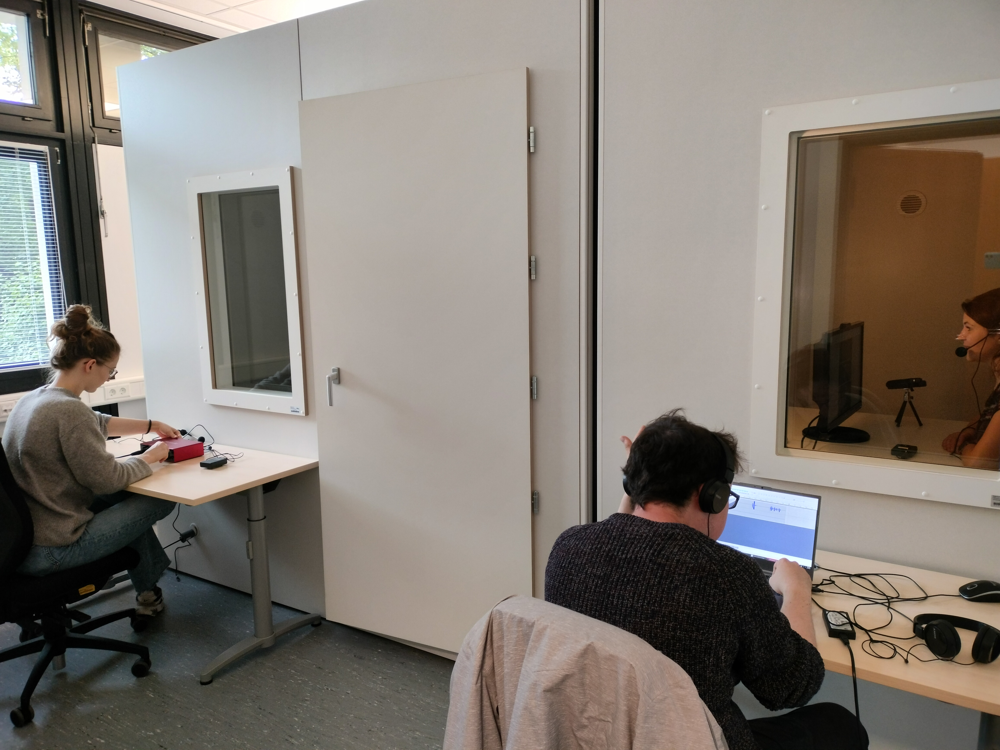
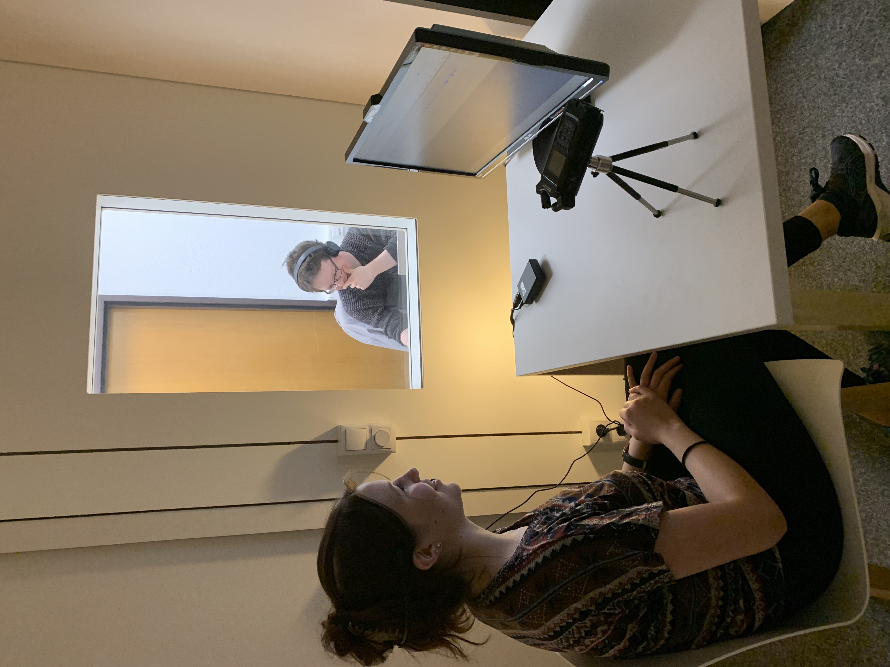
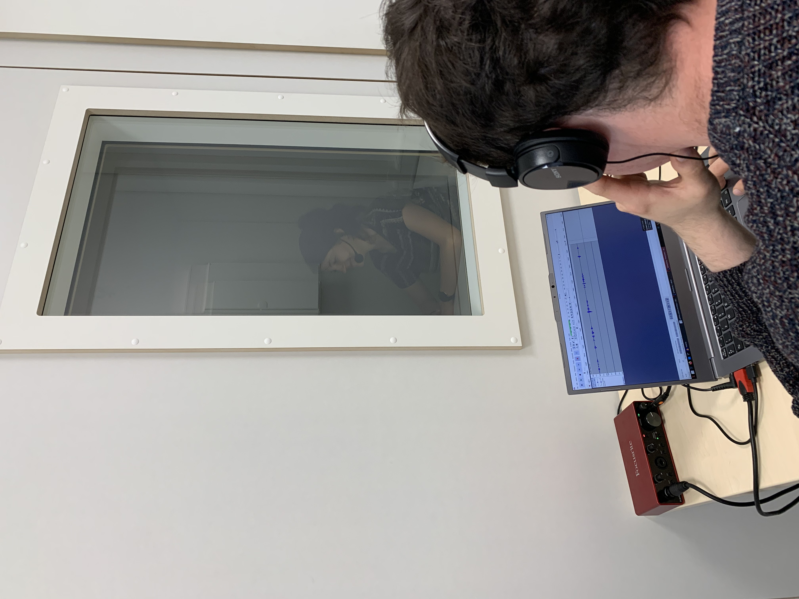

The **SLaM lab** has a spacious phonetics laboratory at its disposal. This space includes three rooms: a recording room, computer lab, and office. 

The recording room features two sound-insulated booths with associated equipment for making high-quality audio recordings. This dual setup allows recordings of conversations between two speakers simultaneously, while windows between the booths facilitate natural interaction.
We are particularly excited to be installing a state-of-the-art electromagnetic articulograph (EMA), the AG501 from Carstens Medizinelektronik GmbH (https://www.articulograph.de/). This system permits recording of articulatory data with a high degree of spacial and temporal precision.
The computer lab includes a number of computers with software for phonetic analysis, and provides a space for teaching as well.

