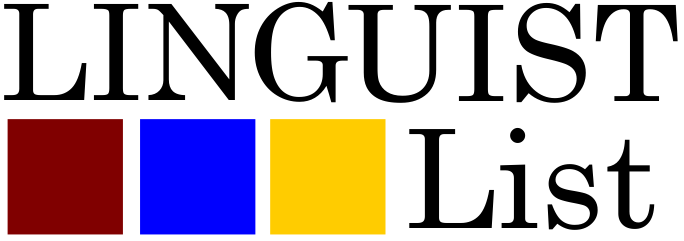

Three members of the Slam lab have been selected as Rising Stars by the Linguist List.

#### Rising Stars (from the Liguist List Website)

This is one of the programs that we run during our Annual Fund Drive where we feature undergraduate and MA students who have gone above and beyond the classroom to participate in the wider field of linguistics. Selected nominees should exemplify a commitment to not only academic performance, but also to the field of linguistics and principles of scientific inquiry. We are looking for those undergraduate and MA students who are excited about participating in the global community of linguistic researchers. Students need not already be published, but should have already contributed in some way to the linguistics community. 

### [Rayyan Merchant](https://slam.phil.hhu.de/authors/rayyan/)

As someone studying both computer science and linguistics, computational linguistics has always been of great interest to me. Due to its heritage from two very broad fields, I believe that we are only just beginning to tap into its full potential despite its already numerous current uses.

Of these many applications, one in particular has firmly held my attention: the application of computational linguistics (and NLP) to societal problems. Researchers exploring this topic have created tools that can detect different types of bias and propaganda, assist medical professionals in diagnosis, and aid students with different learning disabilities. In truth, despite the huge progress made, we are watching this burgeoning field advance in leaps and bounds every day. Due to my interest in this area, I am incredibly thankful to conduct research in the Speech, Lexicon, and Modeling Laboratory, an environment where this concept takes center stage.

Accordingly, my own Bachelor’s thesis project focuses on using linguistics to increase access to the Internet for a linguistic minority. Despite speaking a variety of Persian, Tajikistanis are unable to read anything on the Internet written by Persian-speakers from Iran and Afghanistan, as they write in the Cyrillic script rather than the much more prevalent Arabic script. My work investigates whether a tool can be created to transliterate between the two incongruous scripts. Once our efforts have reached an acceptable threshold, we aim to make our tool accessible via a web browser extension, thereby making the Internet more accessible to speakers of Tajik Persian.

In a country where most interact with the Internet in Russian and/or English, being able to access the Internet in one’s native language (and script) is a remarkable boon, especially for monolingual speakers of Tajik Persian. As someone whose own mother tongue (Konkani) is split between several scripts, I understand how frustrating it can be to know that the language on the screen is your own, yet nonetheless out of reach. It is my belief that the future of computational linguistics is one that occupies itself with easing such frustrations.

Following graduation, I hope to further explore how I may contribute to this through the pursuit of a PhD in computational linguistics or language technology. My eventual goal is to conduct research in the technology industry, working to create tools that can be of particular use to linguistic minorities and marginalized communities.

### [Anh Kim Nguyen](https://slam.phil.hhu.de/authors/anh/)

During my undergraduate years, I used to be very invested in learning about typology, historical linguistics and fieldwork research as a means to support linguistic communities and aid the revitalisation of moribund languages. Being a graduate student now, I know that the process of fieldwork and language documentation has its own problematic aspects and that there are other, more direct, and potentially non-linguistic approaches to the problem. Still, I remain convinced that the findings from linguistic research should benefit people outside of academia in some way, and so, after writing a critical discourse analysis (CDA) on language ideologies in Japan as my BA thesis, I chose my MA classes based on how well they can prepare me to perform empirical research on similar topics with more practical approaches. My most recent project combined quantitative methods from corpus linguistics with the workflow of a CDA in order to identify biases in Japanese news articles, as an experimental attempt to see how quantitative methods can aid qualitative research.

I see the increasing incorporation of digital tools (in the form of e.g. online corpora, and open source software) as an important development in non-computational fields: Not only do they speed up research on large data sets, but they also allow re-approaches to already known phenomena via computer simulations and modeling, and keep research findings replicable and more accessible to other disciplines. It feels like non-computational linguists are beginning to normalise the use of digital tools, which makes it more likely that they will also enter the technical areas of language technology development:

Recent advances in AI managed to create something that can seemingly talk like a real human being, but as these technologies become available to the public (and their sometimes outrageous flaws becoming more apparent), I think linguists can and should help to ensure that these technologies are tested and developed in the interest of all groups of people. That is, linguists should make active attempts to stay informed about the technical workings of language technologies. Linguists should stay able to provide relevant suggestions and criticism in order to e.g. find ways to improve the way AIs "learn" and use language, or - even more generally - push the development of technologies that are primarily adjusted to English data to adapt to other, less richly resourced languages.

In that regard, I am very lucky to be part of the Speech, Lexicon, And Modeling lab whose research topics focus on the mental lexicon, using computational methods among others. I have only recently begun to learn how to work with different programs and write my own scripts, but I can already see how much this knowledge gave me a wider range of approaches to choose from for research, and my lab allows me to put these skills to use. I am also glad that an enthusiastic team at my university has allowed me to join them and organise a computational-linguistics-themed student conference this summer. I hope that this event can inspire the general linguists from my department to pick up some new skills, too.

On a more curiosity-driven side, I am also rather interested in sound symbolism research, and some of my recent projects have focused on sound iconicity and how humans perceive it; the phenomenon alone, and some languages' preferences to make more frequent use of mimetics than others intrigue me a lot. I am especially interested in looking into languages such as Mandarin Chinese and Vietnamese among others, the reason being that some languages have indisputably many speakers, but their uses of sound symbolism haven't been considered too much in contemporary sound symbolism research. Recent theories on the potential role of sound iconicity in e.g. language change, aesthetic perceptions, and its relations to human psychology make this all the more exciting, and I think this is a great opportunity for languages that have mostly been investigated in typological and comparative linguistic contexts to become relevant in other fields, where findings from Indo-European languages (and specifically, Japanese) dominate our knowledge on the topic.

### [Anna Stein](https://slam.phil.hhu.de/authors/anna/)

Language models like ChatGPT have been a much-debated topic recently, generally, but also in Linguistics. Consequences for both teaching and research have amply been discussed with varying degrees of opinions. It is known that even though ChatGPT can be a helpful tool for writing and research, it hallucinates citations, facts, and other information.

I feel that it is particularly important to offer students and researchers the opportunity to understand the inner workings of these models so that they can benefit from these tools yet are aware of their disadvantages and whether or not to use them. At a fundamental level, this requires stirring interest in people, explaining how these technologies work, and beginning to question them. It has been my experience that people in the humanities tend to be more cautious/shy about topics like programming and technology, especially because some people chose a study program in the humanities because they wanted to avoid math or technology.

This was also true for me when I first started to study Linguistics. Over time, however, I became more interested in computational topics and began to learn about them. This was greatly facilitated by people in my environment who helped me on my journey, and I aspire to help others do the same. This is why, as part of my work with the Speech Lexicon and Modelling Lab at HHU, I have been developing tutorials and other open-source resources for various topics, all aimed at people with little to no prior knowledge. As a result, many resources and documentations that I have written are a product of my own challenges, such as acquiring proficiency with programming languages, setting up programs and software, and using open-source tools. Others are a result of my work as a teaching assistant for seminars in the area of digital humanities and programming, specifically aimed at linguists and people from the humanities. The skills acquired in these classes and materials are helpful for any student or researcher, regardless of whether they want to pursue a job in academia, the industry, or other areas.

Another obstacle I see for students that are already interested in learning about computational and technological topics is the pressure of delivering results in an academic setting. It can be daunting to start something without prior knowledge, especially knowing that this will most likely impact future grades and potentially face negative judgment from teaching staff and professors. As part of the organizing committee for the TaCoS, a computer linguistics conference for students only, the team and I make active efforts to reach out to as many students as possible and facilitate their interest in computational linguistics, regardless of their prior knowledge. Since no professors/teaching staff are attending, students can present their work and get feedback and inspiration from other students in the field without feeling pressured to perform well or worrying that they are asking the wrong questions. This will hopefully encourage students to pursue their interests outside of the conference.

Looking ahead, it is also interesting to consider the importance of open-source technology in linguistics. Specific tools and software, for example, neural networks, have found great resonance in some research communities, partially because of their wider availability. Other applications, which are slightly more specific to certain research areas, have yet to be made public and are only passed around among fellow researchers. This makes it considerably more challenging to get into this line of research without knowing the right people and creates an air of elitism around these tools and their related research. In addition, proprietary or private code and software contribute to the looming replication crisis for Linguistics. That is why Akhilesh Kakolu Ramarao and I held a workshop on free and open-source software for research and have been advocating for it during talks in classes. We hope this will enable students and researchers to lower the barrier of entry, understanding, and reproducibility of research.

This topic further relates to the general role of language models and technology in linguistic research. For example, language models such as neural networks have been used for a while in linguistic analysis in order to inform linguistic theory or investigate certain phenomena. However, there has always been a conversation about how well these models can represent language structures in our brains and how applicable their results are to humans if they are unrepresentative, even if they can model prominent linguistic phenomena. My own interest in this topic has developed throughout my Bachelor's degree and has led me to write my Bachelor's thesis on using psychologically-motivated learning models (Naive Discriminative Learning) to explain variation in phonetic details. Other projects for my work at the Slam Lab also pursue this topic and aim to compare the results of psychologically motivated models with models that are not.

I hope that in the future, my research can contribute to developing more psychologically motivated language models, and I can continue my passion for bringing digital skills to humanity students.

|  |  |
| ----------- | ----------- |
| [Rayyan Merchant](https://slam.phil.hhu.de/authors/rayyan/) | [Rising Star Issue](https://linguistlist.org/issues/34.1460/) |
| [Anh Kim Nguyen](https://slam.phil.hhu.de/authors/anh/) | [Rising Star Issue](https://linguistlist.org/issues/34.1379/) |
| [Anna Stein](https://slam.phil.hhu.de/authors/anna/) | [Rising Star Issue](https://linguistlist.org/issues/34.1337/) |
| More Information | [Linguist List](https://linguistlist.org/) |
