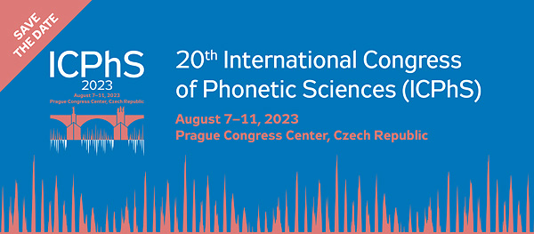

### Talks
- [**Measuring gradient effects of alcohol on speech with neural networks's posterior probability of phonological features**](https://slam.phil.hhu.de/publication/tang-2023-gradient-effects-of-alcohol/) by Ratree Wayland, Kevin Tang, Fenqi Wang, Sophia Vellozi, Rahul Sengupta

### Posters
- [**Individual differences in vowel compactness persist under alcohol intoxication across first and second languages**]() by Charles B. Chang, Kevin Tang, Andrew Nevins
- [**"Kriech da nicht rein:!" - A new corpus of naturalistic misperception of German misheard sung speech**](https://slam.phil.hhu.de/publication/tang-2023-misperceptions-lyrics/) by Jessica Nieder and Kevin Tang
- [**Accommodation to passive media exposure in the L2**](https://slam.phil.hhu.de/publication/geissler-2023-passive-exposure-l2/) by Julika Weber and Christopher Geissler 