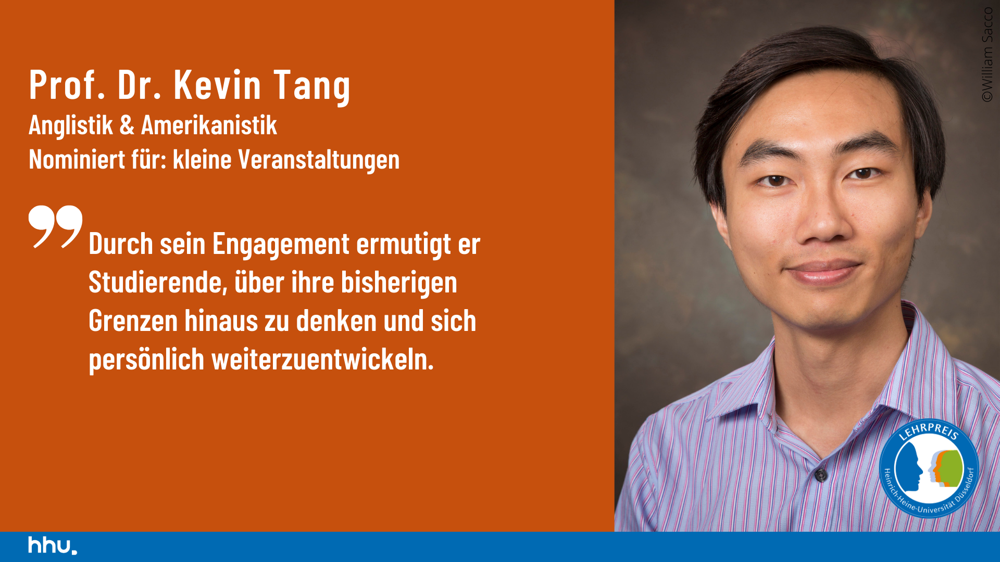

[Prof. Dr. Kevin Tang](https://slam.phil.hhu.de/authors/kevin/) was nominated for the second time for the [Lehrpreis](https://www.sell.hhu.de/lehrpreis) by SELL at HHU.

## The teaching award of SELL at Heinrich-Heine-Universität

With the teaching awards, HHU recognizes outstanding achievements in teaching. Students can nominate all teachers (including adjunct professors) at HHU.
HHU awards the prize in four categories, each of which is endowed with €10,000: Large events with a mediating character (e.g. lecture); Small events with a participatory character (e.g. exercise, seminar, internship); Young academics (employed on a temporary basis, no Venia Legendi) and E-Learning (hein@ward).

Prof. Tang has been nominated for the category "Small events with a participatory character".

|  |  |
| ----------- | ----------- |
| Amount of Award | € 10.000 |
| Nominated | [Prof. Dr. Kevin Tang](https://slam.phil.hhu.de/authors/kevin/) | 
| Additional Information | [Teaching Award (German Website)](https://www.sell.hhu.de/lehrpreis/nominierungen-fuer-den-lehrpreis-2024) |
|  | [SeLL (Service-Center für gutes Lehren und Lernen)](https://www.sell.hhu.de/) |