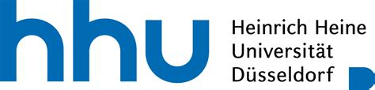

## Project summary:
Our project seeks to familiarise students with the various pitfalls of employing digital tools to translate multilingual literatures. Offering hands-on experiences of the social, political and cultural implications of machine translation (MT), it fosters students’ AI literacy by engaging them in:

1. computer-based translation practices that encourage critical reflection on the manifold biases of those LLMs that inform translation software such as ChatGPT, DeepL or Google Translate; and
2. the creation of parallel corpora that set a new benchmark for digital translation in multilingual literary environments.

AI will likely continue to bring about large-scale societal changes, including the transformation of research and teaching in the humanities or the translation industry, in the years to come. Approaching the numerous risks of AI from the combined perspectives of literary, comparative and translation studies as well as the digital humanities, our project imparts technical as well as conceptual knowledge about translation software, develops critical viewpoints on its social, political and cultural ramifications and devises approaches that serve to de-bias computational translation practices. 

To prove how multilingual fiction can serve to evaluate and pluralize MT, our project builds on and further develops the literary corpus that was created within our first ELFF project. It thus assumes that a range of contemporary Anglophone novels yields the potential to develop a critical awareness about the power hierarchies that structure digital translation and to diversify MT. Accordingly, our project pursues two central objectives:

Firstly, it realises the necessity to engage students in the practical application of translation tools and the critical discussion of AI-generated contents. Apart from understanding the AI ‘black box’, experimenting with different software helps students recognise how computer-based approaches to translation reinforce a monolingual literary norm and thus undermine the epistemic potential of the novels. Drawing on recent approaches in postcolonial and multilingual digital humanities, we believe that the experience of failure provides a necessary step towards a kind of AI literacy which conceptualises the ‘digital’ not as immaterial but as an economic system generative of multi-layered power imbalances. 

Secondly, our project realises the potential to involve students in transforming the digital archive and, in effect, creating knowledge diversity. Seeking to refashion digital translation as a responsible and sustainable practice, we support our students in the creation of parallel corpora. Based on a broad selection of multilingual passages from the novels and their human translations, parallel corpora advance the development of multilingual language models, setting a new benchmark for MT in the context of multilingual fiction.

|  |  |
| ----------- | ----------- |
| Amount of Award | € 11.000 |
| Applicants | [Prof. Dr. Kevin Tang](https://slam.phil.hhu.de/authors/kevin/), [Dr. Hannah Pardey](https://www.anglistik5.hhu.de/team/detailed-pages/detailseite-dr-hannah-maria-pardey)
| Additional Information | [ELFF](https://www.elearning.hhu.de/elearning-foerderfonds) |