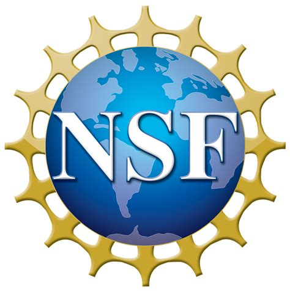

Speech as a non-invasive biomarker could provide researchers and clinicians with new means to capture fine changes in speech articulation patterns associated with linguistic phenomena in the normal population or functional changes in articulation in individuals with disorders. The overarching goal of this project is to establish an evidence-based, quantified, data driven, non-invasive method for using speech as a biomarker for facile detection of cross-linguistic variation and patterns of articulatory change in various neuromotor disorders within the linguistics and biomedical realms. This interdisciplinary project has three interactive arms: the development of a smart, wireless, electropalatography (EPG) system, behavioral speech data collection for comparison with existing EPG systems, and machine learning for identifying patterns of tongue-palate contact that signify abnormal patterns of articulation. This work would lead to establishing a new techno-linguistic and techno-speech pathology disciplines and related curricula. SELMA performance will be disseminated through new courses, class lectures, conference presentations, publications, and mass/social media. PIs volunteer for minority programs.

The usage of speech sounds as a biomarker offers advantageous features such as non-contact detection and remote monitoring. However, the acoustic signature alone is not sufficient to provide reliable sensing for linguistic and clinical use. In this project, a unique real-time, multi-modal, wireless smart electropalatography (EPG) system for linguistic and medical applications (SELMA) is devised and implemented to provide additional oral sensing modalities, including precise position, size, pressure, and duration of tongue contacts with the palate in speaking. A pseudo-palate, the main apparatus of the system, is 1/20 the thickness of a typical pseudo-palate, minimizing the blockage of airflow during speech production and conform to the palate, reducing the discomfort of the wearer and offering a close-to-normal mouth condition during speech articulation. Wireless charging and communication are used increasing reliability and safety. The advantage of the SELMA device is evaluated via a behavioral linguistic experiment to assess detection of a common class of cross-linguistic, phonological processes known as spirantization, a process involving decreased precision of speech articulation. Machine learning models, integrating articulatory (i.e., EPG) and acoustic data, are used to predict degrees of lenition and subjective lenition ratings. By fine-tuning the models on latent speech patterns with big data of atypical speech from PD patients, intoxicated speakers and second-language accented speakers, the SELMA system will provide a unique form of diagnostics for medical and linguistic purposes. The usage of high resolution spatio-temporal information of tongue contacts during speech can be extended for facile monitoring of neurological diseases such as PD, amyotrophic lateral sclerosis (ALS), traumatic brain injuries, and other neurological disorders. Further, SELMA will be inexpensive and small enough that can be used for monitoring treatment progress in pediatric articulation disorders affecting intelligibility, such as cleft palate, apraxia of speech, and Down syndrome. Future variations of SELMA may extend its utility to other disease monitoring with additional sensors integrated into the device, potentially allowing monitoring of cancer, HIV, smoking and sexually transmitted diseases using salivary biomarker sensors.

This award reflects NSF's statutory mission and has been deemed worthy of support through evaluation using the Foundation's intellectual merit and broader impacts review criteria.

|  |  |
| ----------- | ----------- |
| Award Number | 2037266 |
| Start date | September 1, 2020 |
| End date | August 31, 2023 (Estimated) |
| Awarded Amount | $750,000.00 |
| Additional Information | [National Science Foundation](https://www.nsf.gov/awardsearch/showAward?AWD_ID=2037266) |
