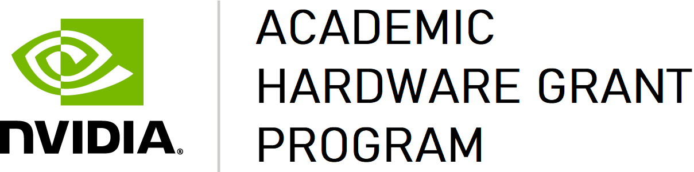
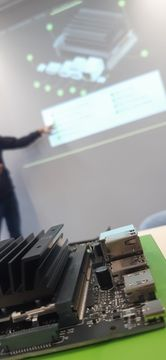

### The NVIDIA Academic Hardware Program

The [NVIDIA Academic Hardware Grant Program](https://mynvidia.force.com/HardwareGrant/s/Application) endeavors to advance education and research by:

1. Enabling groundbreaking, innovative, and unique academic research projects with world-class computing resources. 
2. Providing educators with a hands-on platform to teach AI, deep learning, and data science to students in any discipline.

## Course linked to the Grant:
Language technology for Linguists with the Internet of Things (IoT)
by [Akhilesh Kakolu Ramarao](https://slam.phil.hhu.de/authors/akhilesh/)

### Course Description:

Have you ever wondered why Voice Assistants (Siri, Amazon Echo and Google Assistant) could not quite understand your English accent? We, as linguists, can play an important role as evaluators of such complex systems. Through this beginner-friendly course, you will open up the black box of language technology by building them with mini-portable computers. In the process, you will acquire new digital skills that complement your linguistic training. Specifically, you will be given the unique opportunity to apply your English and linguistic knowledge for building everyday language technology applications such as evaluating the voice assistant's ability to perceive and produce different English accents, prosody patterns, styles, and emotions.

You will be primarily working with mini-portable computers, [NVIDIA® Jetson Nano Developer Kit] (https://developer.nvidia.com/embedded/jetson-nano-developer-kit). With the NVIDIA Kits, you will build an interactive machine that can speak (Speech Synthesis - convert written text into spoken speech) and can listen (Speech Recognition - transcribe spoken speech into written text). Furthermore, you will evaluate automated systems using linguistic analysis and provide you an opportunity to come up with novel linguistically-motivated evaluation methods.

|  |  |
| ----------- | ----------- |
| Awarded Amount | 20 × NVIDIA® JetsonTM Nano Developer Kits |
| Additional Information | [Nvidia Academic Hardware Program](https://mynvidia.force.com/HardwareGrant/s/Application) |
