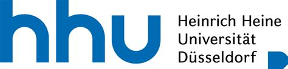

## Project summary:
A range of recent Anglophone novels are located at the edge of English, fostering connections to other languages such
as French, Hindi, Italian, Kiswahili, Mandarin or Spanish. The project seeks to introduce students in the Master’s degree
programmes “Comparative Studies” and “Literary Translation” to the potentials of approaching multilingual narratives
by employing computer-based digital humanities methods derived from corpus linguistics and natural language
processing.

Availing itself of HHU’s various e-learning services and tools, the project provides a hands-on experience of
analysing and translating passages of selected post-monolingual Anglophone novels in an immersive online
environment. We will make use of interactive video tutorials, complementary quizzes and an academic blog.
We will create three interactive video tutorials to acquaint students with computational literary studies in general and
the usefulness of ANNIS, an open-source corpus linguistics software, for analysing and translating multilingual
literature in particular. An instance of ANNIS has already been hosted and launched at a HHU server:
https://annis.slam.phil.hhu.de/.

Going beyond available ANNIS tutorials, we will develop interactive content with H5P
and examine specific literary examples, stressing that digital tools not only facilitate the analysis and translation of
literary texts but also reinforce linguistic (and other) power hierarchies. Proceeding from this critical position, the
videos will illustrate how ANNIS can be used to:

1. convert passages of selected literary texts into linguistics formats to enable annotations on distinct linguistic levels and, in effect, the creation of a unique dataset that conforms to copyright laws

2. scrutinise this dataset for different types of multilingual narration

3. transform this dataset into a parallel corpus to study translational phenomena.

To assess the effectiveness of the interactive video tutorials and prepare students’ independent study of literary examples, we will develop three complementary quizzes that allow
students to remember, apply and critically reflect upon the video content. Furthermore, and attesting to the project’s
experimental and collaborative design, students will discuss their experiences with the application of corpus linguistics
software in literary and translation studies contexts in an academic blog.
In the future, we envision developing a follow-up project that moves beyond textual analysis and creating empirical
data on how readers of varying degrees of bilingualism handle and understand post-monolingual Anglophone novels.

|  |  |
| ----------- | ----------- |
| Amount of Award | € 10.000 |
| Applicants | [Prof. Dr. Kevin Tang](https://slam.phil.hhu.de/authors/kevin/), [Dr. Hannah Pardey](https://www.anglistik5.hhu.de/team/detailed-pages/detailseite-dr-hannah-maria-pardey)
| Additional Information | [ELFF](https://www.elearning.hhu.de/elearning-foerderfonds) |