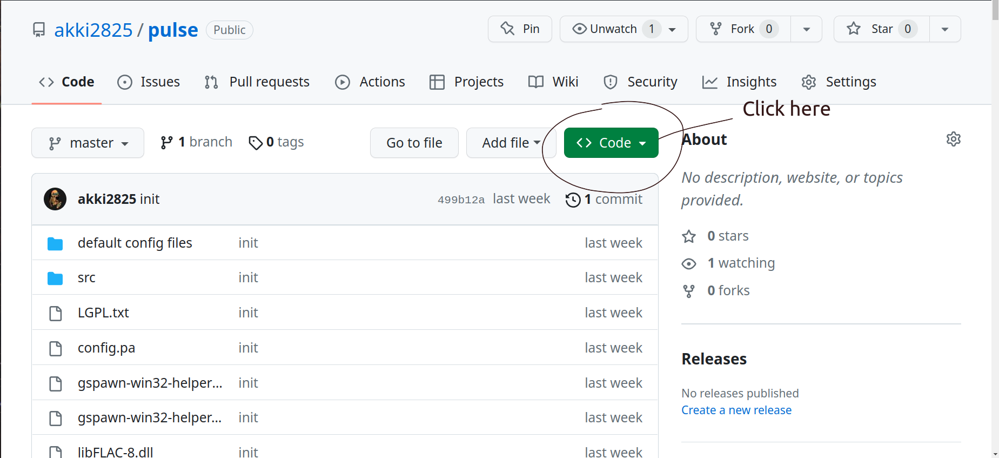
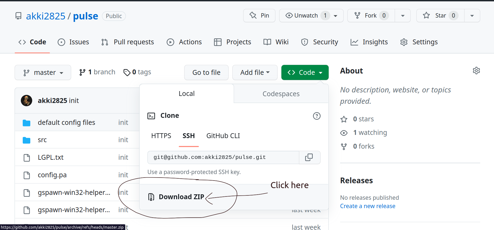
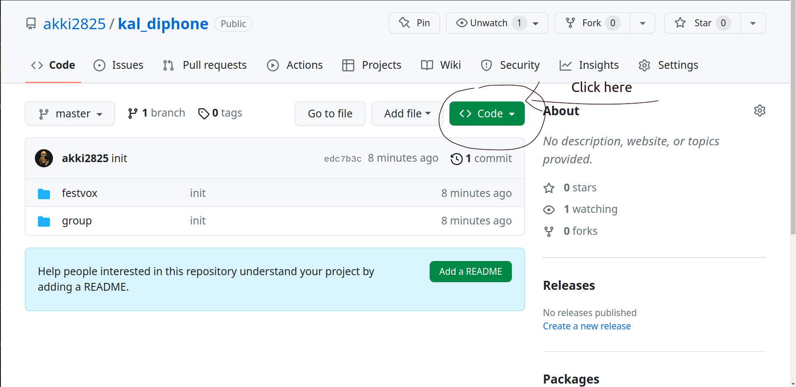
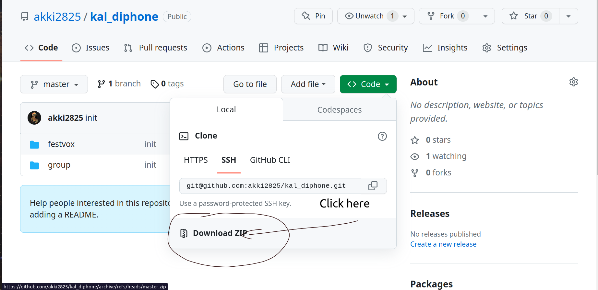
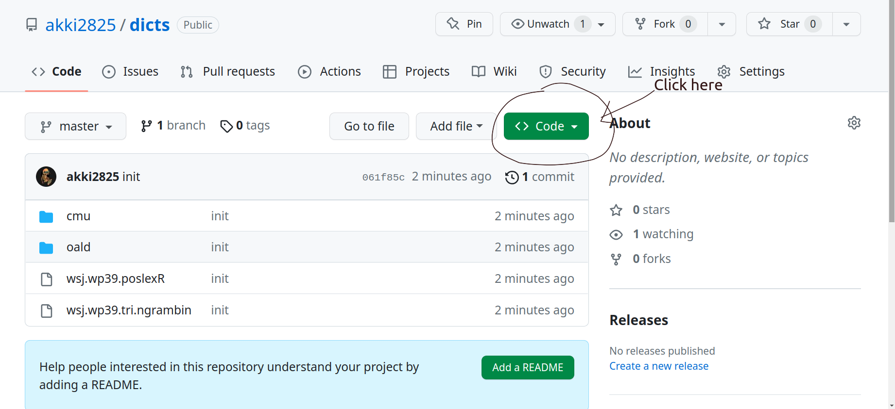
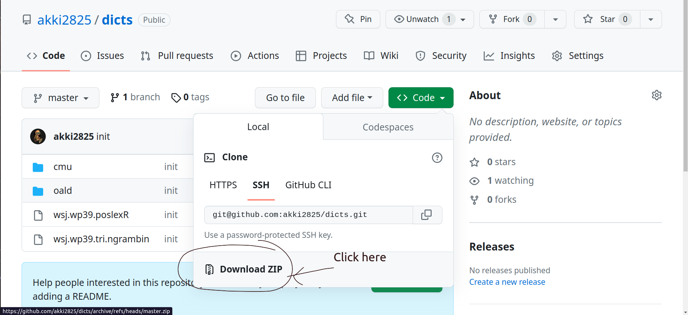

# Festival TTS

This is a guide to install and run [Festival TTS](https://www.cstr.ed.ac.uk/projects/festival/) on Windows and MacOS.

## Installation

### Windows

Here we are assuming that you are working with Windows Sub-system Linux 2 (WSL2). If you don't have WSL2 installed, please refer to this [guide](https://docs.slam.phil.hhu.de/#/wsl).

#### Download and Install Pulseaudio

Step 1: Let's first download the customized pulseaudio as shown below:






Step 2: Unzip the pulse folder and paste this inside C:\ folder.

Step 3: Open the Windows command prompt as administrator and type the following:

```sh
C:\pulse>pulseaudioservice install
```

Step 4: Open `Ubuntu` terminal and type:

```sh
sudo apt install pulseaudio
```

#### Install Festival TTS

Open `Ubuntu` terminal and type:

```sh
sudo apt-get install festival
```

#### Launch Festival

In your `Ubuntu` terminal, type:

```sh
festival
```

For testing, type:


```sh
(SayText "hello world!")
```

### MacOS

Check if `homebrew` is installed using:

```
brew
```
If you do not get any error message, you are good to go! Otherwise, you need to install `homebrew` using:

```
/bin/bash -c "$(curl -fsSL https://raw.githubusercontent.com/Homebrew/install/HEAD/install.sh)"
```

First install [Pulseaudio](https://en.wikipedia.org/wiki/PulseAudio) using:


```sh
brew install pulseaudio
```

Step 2: Install [gcc](https://gcc.gnu.org/) using:

```sh
brew install gcc
```

#### Installing Festival

Step 0: Open the terminal using `Cmd+space` and type `terminal` and hit Enter.

Step 1: Create a folder inside the terminal by copy-pasting the below lines:

```sh
mkdir -p tts/tools/
```

Go inside the above directory by typing:

```sh
cd tts/tools/
```

Assigning the directory path to a variable; copy and paste the below lines in the terminal:

```sh
echo 'INSTALL_DIR=`pwd`' >> ~/.zshrc
cd $INSTALL_DIR
```

Step 2: Download Festival using:

```sh
wget http://www.cstr.ed.ac.uk/downloads/festival/2.4/festival-2.4-release.tar.gz
```

Download some additional Festival tools using:

```sh
wget http://www.cstr.ed.ac.uk/downloads/festival/2.4/speech_tools-2.4-release.tar.gz
```

Untar the above files using:

```sh
tar xvf festival-2.4-release.tar.gz
```

```sh
tar xvf speech_tools-2.4-release.tar.gz
```

Step 3: Go inside Speech tools directory using:

```sh
cd speech_tools
```

Copy and paste the 2 lines below one at a time:

```sh
./configure  --prefix=$INSTALL_DIR
make
```
Go inside festival directory using:

```sh
cd ../festival
```

Copy and paste the 2 lines below one at a time:

```sh
./configure  --prefix=$INSTALL_DIR
make
```

Step 4: Exporting the path to `~/.zshrc` using:

```sh
echo 'export PATH=$INSTALL_DIR/festival/bin:$PATH' >> ~/.zshrc
```

#### Download voices and dictionaries


Download voices by first going to:

```sh
https://github.com/akki2825/kal_diphone
```

Follow the below steps to download the voices:






Download the dictionary by first going to:

```sh
https://github.com/akki2825/dicts
```

Follow the below steps to download the dictionary:






Now unzip both the files.

Create a new directory for english voices using:

```sh
mkdir -p ~/tts/tools/festival/lib/voices/english/
```

Now copy both `kal_diphone` and `dicts` folder inside `~/tts/tools/festival/lib/voices/english/`


Start Pulseaudio using:


```sh
brew services start pulseaudio
```

#### Launch Festival

In your terminal, type:

```sh
festival
```

Copy the below commands one by one:


```sh
(Parameter.set 'Audio_Required_Format 'aiff)
(Parameter.set 'Audio_Method 'Audio_Command)
(Parameter.set 'Audio_Command "paplay $FILE --client-name=Festival --stream-name=Speech")
```

For testing, type:

```sh
(SayText "hello world!")
```

### Authors

[**Akhilesh Kakolu Ramarao**](https://slam.phil.hhu.de/authors/akhilesh/)
