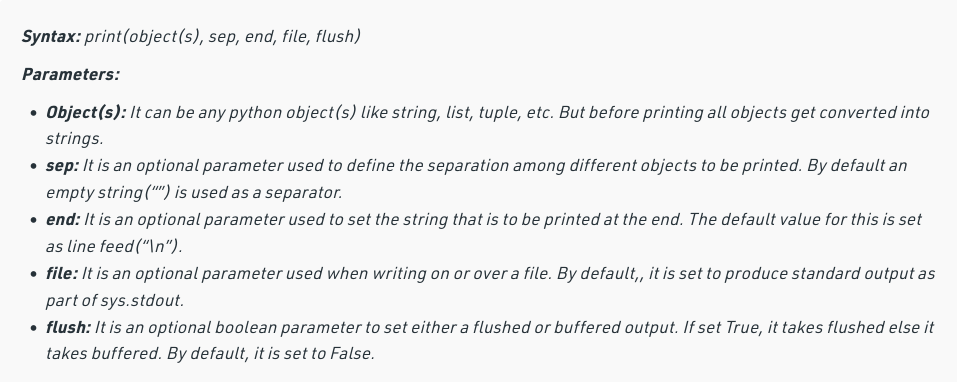
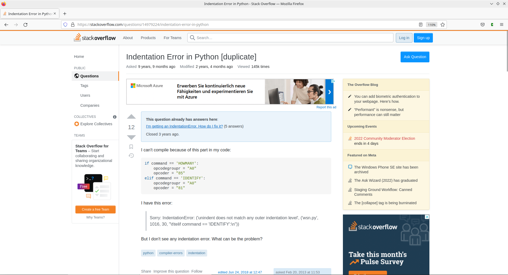
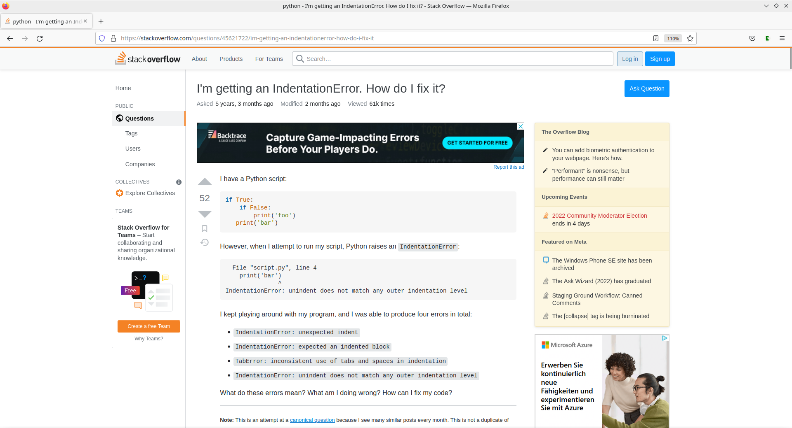
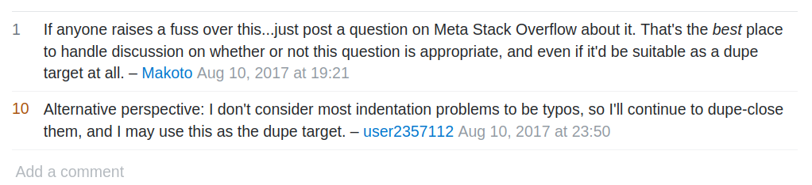
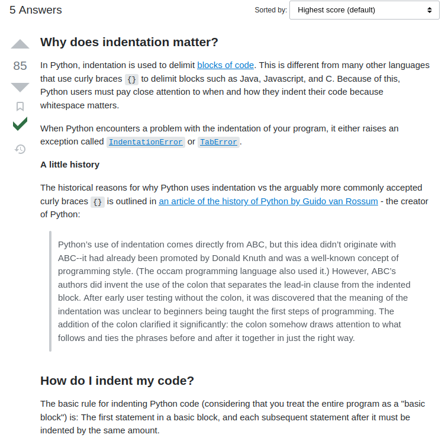

# How to debug 101

Sooo you just got an error message while coding and don't know what to do. We got you :point_down:

This guide assumes very little knowledge, but sometimes, concepts are mentioned that might be unfamiliar to you. The common theme in this guide is that you look things up. This is also what you are encouraged to do if you encounter these unfamiliar conecpts. TO make it easier for you, most of them already link to an explanation so, use them :)

Contents


## Types of error messages and how to read them

In order to solve an error, you have to understand it first. Errors occur because of problems in the code that caused its execution to halt. When they occur, Python gives you information on why what type of error occured and where it occured. 

---

There are two main types of errors in Python:
1. Syntax errors
2. Exceptions/ Logical errors

---

### Syntax errors 

Syntax errors occur when we use an **incorrect syntax of a command**, meaning we use the command in a way that Python does not understand. These are the type of error you will run into most when you start programming and luckily, they are pretty easy to solve. Let's consider this error:
```Python=
  Cell In [3], line 1
    print('Hello there, General Kenobi.'
                                        ^
SyntaxError: unexpected EOF while parsing
```
In line one we see the **file or cell, and the line where the error occured**. You can tell that this error is from a [Jupyter Notebook](https://oxylabs.io/blog/what-is-jupyter-notebook) because the line references a cell. Specifically, this error would show up below the cell in which the error occured. If you were to use a Python script or the error occurs within a [package](https://www.geeksforgeeks.org/python-packages/), this line would indicate the file in which the error occured, for example: 
```Python 
File "/home/user/secretcode/nsa.py", line 1
```
Line two shows us the **specific line of code that triggered the execution to stop**. The line below only consits of a small hat that indicates which part of the line caused a problem. Without even knowing what kind of error it is, we get a lot of information on where to look for fixing our error. 

Finally, the last line contains the **type of error** and more information.
In this case, Python encountered an 'unexpected EOF while parsing' (EOF = end of file). This a typical error when you forget to close your quotes or parentheses, which is exactly what happened here. Python is trained to look for an opening and a closing bracket/quote and when that is not found, ther eis an error. We can fix the error by writing `print('Hello there, General Kenobi')` with a closing parenthesis. 

If you get a syntax error and you are not sure what the correct syntax of a command is, e.g. if you need parenthesis, if you are missing something in the parenthesis etc., you can always **google the commands syntax**. More information on how to google and find solutions there in [this paragraph](#how-to-google-better).

### Exceptions

Exceptions occur when the syntax of your command is correct but something else causes an error. In that case, Python directly details the type of error:
```Python =
Cell In [7], line 2
    print('haw')
    ^
IndentationError: expected an indented block after 'if' statement on line 1
``` 
This time, the syntax of the print statement is correct, but we get an indentation error, one type of the **built-in exceptions in Python** (full list [here](https://docs.python.org/3/library/exceptions.html)). If we look at our code, we can see that indeed the print statement is missing an indent.
```Python
if ye:
print('haw')
```
We can correct this by indenting the print statement by either four spaces or one tab, both count as [indentation in Python](https://www.geeksforgeeks.org/indentation-in-python/). However, you need to be careful not to mix them because this will also throw an indentation error and is very annoying to correct depending on your [IDE](https://networklessons.com/python/python-integrated-development-environment-ide). 

If you're wondering whether the existence of in-built errors implies the existence of non-in-built errors, yes they exist, you can **make custom ones** for your code. This is not important if you're just starting to code but if you would like to more about that, check out [this article](https://realpython.com/python-exceptions/).

### Logical errors
These are semantic errors which ususally don't cause the programm to stop executing but make it behave differently than what the programmer intended, for example a wrong variable assignment. 

## Finding help: Explanations and Solutions
Once you have carefully read your error message (!!) you either want to find a solution or an explanation of your error, in case you don't understand it from the error message. You can either ask other people or consult the internet. 

### Explaining your code (problem) to others
When explaining your code (problems) to others, it is important to be able to explain them precisely and to give context. While most syntax errors are to solve, the more you code, that will change. 

1. **Say which language you are programming in.** 

2. **Give information on your software and hardware.** 
First of all, say how you are using Python (e.g. in Jupyter Notebook, Anaconda, VSCode, command line ...). Some errors are IDE specific or need a different solution on Jupyter Notebook than in the command line. Other system specifications are also helpful, like what operating system your laptop/PC has (Linux, Windows...) and which version of Python/the operating system a certain package has. 

[This section](#getting-information-on-software-and-hardware) explains how to get this information if you don't know yet.

4. **Describe your problem precisely.** Depending on what you need help with, you can talk about the abstract problem (e.g. you want to generate a frequency list from a text and you dont know how) or the concrete problem in your code (e.g. my for-loop throws this exception...)

5. **Say which solutions you have tried and why you tried them and how they did not work (Step 4.)**

5. **Give context.** Do not just send somebody the error message that you have got. That information alone will probably not be helpful to somebody trying to help you. Always also send the code where the error occured. You can see where that is in the first lines of the error message, as described above in [how to read errors](#types-of-error-messages-and-how-to-read-them).


### How to google better
You will probably have tried googling your problem and might have found lots of results that are not helpful at all. Then you ask somebody to help and they find a solution within one search. What is their secret?

First of all, it is very normal to spend a lot of time looking things up, errors, commands, information, whatever it is. This is what most people who code spend their time with and is by no means an indication of how good or bad you are. It is also a good way to learn how to code and get to know important concepts within a certain language. If you have to ask somebody for every single thing you don't understand, your progress will be slow. That not only applies to coding but all kinds of learning. 

The most important thing when looking up code-related things is to **mention the programming language in your search query**. Problems are often the same across programming languages so you might end up with a solution that only works for [Fortran](https://de.wikipedia.org/wiki/Fortran) but not for Python. Additionally, you get better results if you use the correct **technical terms**. This can be as 'simple' as mentioning  `list` or `dictionary` in your search query but can also be difficult if you don't really know what you are looking for. In that case, look for technical terms that are mentioned in guides, tutorials and [Stack Overflow](#understanding-stack-overflow) answers. Look up the terms, try to google with them and see if they are relevant for your specific problem.

:sparkles:
>If you get frustrated doing this, remember that you will have a much easier time the next time you run into this kind of problem, because you have a more precise way to look for solutions. This will get significantly easier the more you do it. 

#### Picking out a website from the search hits
Let's say we want to solve the indentation error from earlier and you look it up. You get a bunch of results. If you look at the headings of the search hits, you can see the url of the website that the answer is from (lines 1 and 5). 

```=
https://www.javatpoint.com › indentation-error-in-python
Indentation Error in Python - Javatpoint
Examples of Python Indentation Error: Example 1: # Python program to find the maximum out of two numbers: def max (x,y): # max function will return the maximum among the two numbers if (x>y): return x else: return y a = int(input ("Enter a number: ")) b = int(input ("Enter another number: ")) print ("Finding the Maximum out of a:", a ,"and b:", b)

https://stackoverflow.com › questions › 14979224
Indentation Error in Python - Stack Overflow
Indentation Error generally occurs when the code contains a mix of both tabs and spaces for indentation. I have got a very nice solution to correct it, just open your code in a sublime text editor and find 'Tab Size' in the bottom right corner of Sublime Text Editor and click it. Now 
```
We can see that the first one is a website called `javapoint.com` which promises examples of the Python indentation error. Whether you know that Java is another programming language or not, you know that examples are not what you need, you already have one. Over time, you will recognize the websites that always show up and they type of explanation they usualy provide. For now, **here is a list of websites that generally are helpful:**
- RealPython [https://realpython.com/](https://realpython.com/) - Very high quality tutorials tough they are sometimes hidden behind a paywall.
- GeeksforGeeks [https://www.geeksforgeeks.org/](https://www.geeksforgeeks.org/) - Great for looking up the syntax of commands
- W2Schools [https://www.w3schools.com/](https://www.w3schools.com/) - More great tutorials and explanations
- StackOverflow [https://stackoverflow.co/](https://stackoverflow.co/) - A popular community forum for programming questions. You will land here a lot (see [this paragraph](#understanding-stack-overflow) for more info).

#### Prioritizing solutions 
There certain types of solutions that you should consider only as a last resort. These are the types of solutions that influence a lot of pieces in your code, packages of your coding environment. Definetly consider smaller scale changes first before you update all of your packages (that is a free 'Go to [dependency hell](https://en.wikipedia.org/wiki/Dependency_hell). Do not continue working.' Monopoly card.) If you are unsure about the scale of the solutions you are looking at, ask somebody for help:)

#### Looking up the syntax of a command
The best way to prevent syntax errors is to look up the correct syntax of a command. This is pretty straightforward: specify the language, the command and 'syntax' like this: `<language> <command> syntax` (for example: `Python print syntax`). 
Often the result you get for this is more than you need. Below you see the syntax for the print command taken from the [GeeksforGeeks website](https://www.geeksforgeeks.org/python-print-function/).



You can see that this looks much more complicated than what you usually use the command for. This is why you should **always look at examples of how to use the command** which generally are given below its syntax. While most of the time, you do not need to worry about the optional parameters of a command, it is always useful to keep in mind what else a command can do since you might need it in the future. 

#### Googling a syntax error/ an exception
Generally, **looking up errors requires some level of abstraction**, both for your problems and the solutions that you find. As you know, there are many ways to achieve the same result in programming. The odds of finding someone with exactly the same code that has the exact same problem are very low, especially the more you code and the more complex your problems become. 

Therefore, it makes more sense to **look up the concrete error code or problem** instead of the piece of code that caused it. For the indentation error we would use line 4 instead of line 2. Depending on your problem, you might want to look up only the exception `indentation error` and not all of line 4. You can judge this on a case-by-case basis depending on the results that you get.

```Python=
Cell In [7], line 2
    print('haw')
    ^
IndentationError: expected an indented block after 'if' statement on line 1
```
You would look this up with `<error message> <language>`, or in this case:
```Python
IndentationError: expected an indented block after 'if' statement on line 1 Python
#or
IndentationError Python
```
You will probably end up on Stack Overflow so its worth reading [the paragraph](#understanding-stack-overflow) about understanding Stack Overflow :point_down: :)


### Understanding Stack Overflow 
Stack Overflow is a website where people can ask questions and other people can answer, think of [Quora](https://www.quora.com/about) or [Gute Frage](https://www.gutefrage.net/) but for programming. Everybody who codes uses it. Odds are what you want to know has been asked and answered on Stack Overflow. 

If we google the indentation error from above and chose the Stackoverflow solution you will see this:



At the very top you can see the question that a person asked and below that the details that they provided. In this case, you can see that the question was already answered and that this is a duplicate question, so you want to go to the original question since this will have the better answers. Once you go there you will see the same setup as before, but without the duplicate box. 



There is a lot of information on this page so let's break it down (insert Lucio gif here).

#### The question
The quality of the question will vary a lot from post to post. By that I mean how much information is provided and how well the person explained the question. Don't spend much time on trying to understand the code of the person asking the question. We have already estabilshed that there are many ways of doing the same thing. As long as they have the same problem as you, odds are the solution to their problem will help you as well. On the left side you can see two arrows. They are for up-and downvoting the question. Don't worry about it, you can't vote unless you're logged in and have posted upvoted questions yourself. 


#### Answers and comments
Right below the question you can see some smaller comments. You can comment below both questions and answers. These ARE worth reading. Sometime people share helpful links there, even when a questions has not yet been answered.



Below the comments you can see all of the answers. The answer with a green checkmark is the answer that has been marked as 'this solved my problem' by the person who asked the question, the 'OP' (original poster).



If there is no checkmark on any answer, the one that has been upvoted most by other people will appear at the top. Either way, these will usually contain a solution. In this case, it is a very elaborate and well written answer (which is also confirmed by the people in the comments, if you believe them). Answers are not always this good and you might have to do some puzzling and look in the comments to get it. 

### Code Documentation
If you are working with code another person wrote or are having trouble with the code of a certain package, it is always worth looking at the documentation. The documentation of a project, whether it is an official package or not, should always have explanations of functions, and other commands related to the package, as well as how to install/use it. 

For packages, you can find their documentation if you google `<package> documentation`. If I wanted to know what the [Pandas package](https://pandas.pydata.org/docs/) is, you could look up `pandas documentation` and you would find out that it is a popular Python library for working with tables. 

Individual projects that are on [GitHub](https://github.com/) for example, often have such explanation in the README file on the first page of the repository. A guide on how to navigate GitHub can be found [here](https://slam.phil.hhu.de/#/github_tut). 

## What to do if you feel overwhelmed/unsure
If you are a member of the IoT seminar with Akhilesh, you can contact either [Anna](mailto:anna.stein@hhu.de) or [Akhilesh](mailto:kakolura@hhu.de).
In general, you can always contact somebody that you feel could help you or direct towards appropriate ressources.

Or just Take a break. It is easy to get stuck with a problem, get very frustrated and lose sight of what you are actually doing. Most problems solve themselves if you take a break and come back to them later. Even if its your job ans its frustrating sometimes, in the end, coding should be a fun thing.  

## Getting information on software and hardware
**Windows**
1. Click the Windows Start button
2. Settings
3. System
4. Scroll down, click About
5. Copy the first box called 'Device specifications'. 
(For issues, you can leave out `device name` and `pen and touch`, unless they are specifically relevant)

**Linux**
System information:
`sudo lshw -short`

(If you are bored, leave out the 'short' and see what happens).
You can also use `uname` To get a shorter version. 

Kernel information with `uname`:
- Kernel name -> `uname -s
- Kernel release information -> `uname -r`
- Kernel version -> `uname -v`

**Mac OS**
1. Apple symbol at the top of your screen
2. About this Mac
3. System Report
4. Choose the relevant information from there. 

**Package information in Python**
- All installed packages + versions -> `pip list` or `pip freeze` or `conda list`
- All packages used by a script + versions -> `pip3 install pipreqs` then `pipreqs ./pathtoyourscript` (You get a requirements.txt file with the dependencies)


## Authors
[**Anna Stein**](https://slam.phil.hhu.de/authors/anna/)
