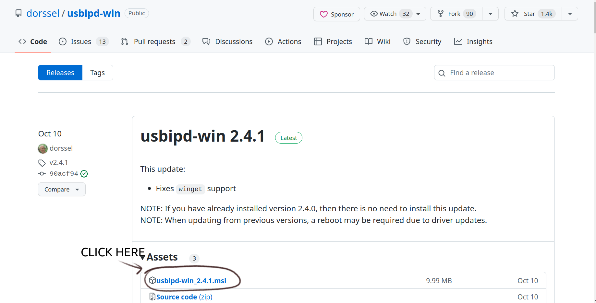
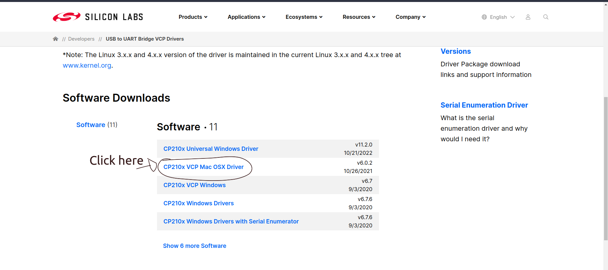
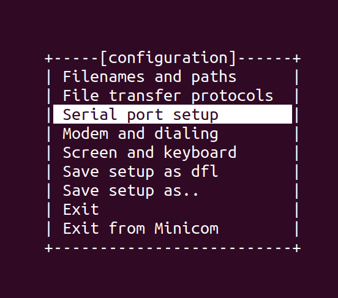
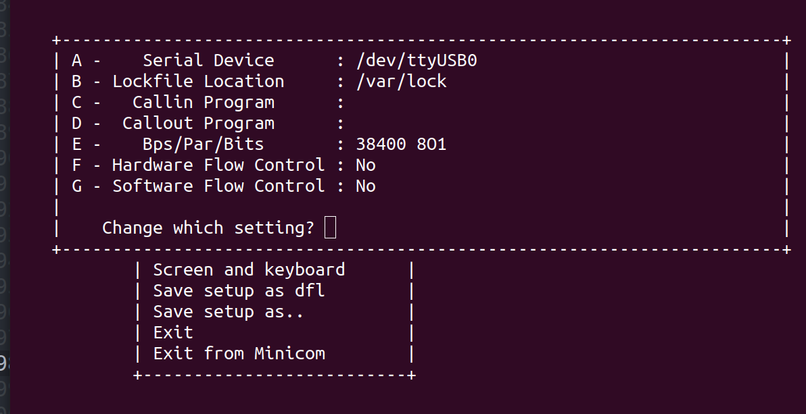
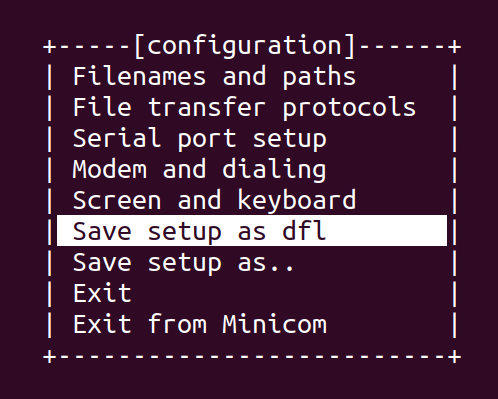

# How to setup nvidia jetson nano kits
## You need:
- [ ] A **micro SD card*** with 64GB+ storage to flashing the OS onto 
- [ ] An **hdmi cable** to connect the kit to a monitor
- [ ] A **power cable** for the nvidia computer
- [ ] A **micro-usb cable** to connect the kit to a computer
- [ ] A **jumper-cable**
- [ ] An **nvidia jetson nano kit** (obviously)

## Sanity Check (and for bootable SD cards)
1. Put the micro SD-card in an adapter and into your laptop.
2. In the disk manager, check if the SD-card has its full sotrage available. 

**If yes:** Proceed to the step [SDK manager](#sdk-manager).
**If no:** Continue with the steps below.

3. Go into the SD-card storage manager by clicking on the Sd-card in your file system. On the top right, make sure you are in `/dev/mmcblk0` or a similar directory, and not the local. 
4. Delete all partitions or other elements that are not `Free Space`. IF only free space is left, continue to [SDK manager](#sdk-manager). 


## SDK manager
Connect all of your cables. Connect the jumper cable on `FC REC` and the `GND`above it.  
1. Start the SDK manager on your laptop.
2. Choose `Jetson nano modules` as your target device and click on next step.
3. Accept the conditions at the bottom left and click next step.
4. Choose manual setup and the nano jetson kit with 2GB. Set the username and password.
5. Remove the jumper cable. 
6. Click on flash. You should see a progress bar with the flash progress. 
7. Wait for the OS-screen on your monitor, even if the flashing process is complete. Then click install. 

# Connecting Jetson Nano to your device

The serial debug console connector is underneath the Jetson module, directly below the SD Card reader.

Connect:

```
Jetson Nano J50 Pin 4 (TXD) → Cable RXD (White Wire)
Jetson Nano J50 Pin 3 (RXD) → Cable TXD (Green Wire)
Jetson Nano J50 Pin 7 (GND) → Cable GND (Black Wire)
```

## Windows Subsystem Linux (WSL)

Download and install usbipd-win by clicking on  https://github.com/dorssel/usbipd-win/releases



Follow the installation procedure and make sure that you complete all the steps.

Next, we need to install tools to identify USB devices.

Copy and Paste the below commands in your WSL terminal

```sh
sudo apt install linux-tools-5.4.0-77-generic hwdata
sudo update-alternatives --install /usr/local/bin/usbip usbip /usr/lib/linux-tools/5.4.0-77-generic/usbip 20
```
### Serial communication program

Install [minicom](https://en.wikipedia.org/wiki/Minicom)

```sh
sudo apt-get install minicom
```


**NOTE:** Perform the next set of steps only once you receive the device.

### Attaching Jetson Nano device

From an *administrator* command prompt on Windows, run this command:

```sh
usbipd wsl list
```
Select the bus ID of the device you’d like to attach to WSL using:

```sh
usbipd wsl attach --busid <busid>
```

We have now updated the configuration options for the WSL Linux kernel to enable USB support.

## MacOS

### Download and Install VCP drivers

Go to [https://www.silabs.com/developers/usb-to-uart-bridge-vcp-drivers](https://www.silabs.com/developers/usb-to-uart-bridge-vcp-drivers)



Download and follow the installation instructions.

### Serial communication program

Install brew

```sh
/bin/bash -c "$(curl -fsSL https://raw.githubusercontent.com/Homebrew/install/HEAD/install.sh)"
```

Install [minicom](https://en.wikipedia.org/wiki/Minicom)

```sh
brew install minicom
```
## Ubuntu

### System dependencies

```sh
sudo apt-get install linux-image-extra-virtual
```

### Serial communication program


Install [minicom](https://en.wikipedia.org/wiki/Minicom)

```sh
sudo apt-get install minicom
```

## Setup Minicom

Running

```sh
sudo minicom -s
```

Make sure the NVIDIA device is connected to your laptop with the TTL to USB convertor.




Go to Serial port setup and hit `Enter`. 



Change Serial Device by hitting `CAPS-A` and changing the serial device to `/dev/ttyUSB0` and hit `Enter`. 



Press `Exit from Minicom` to quit.

## Running Minicom

**NOTE**: Make sure the NVIDIA device is connected to your laptop with the TTL to USB convertor.


Start minicom using:

```sh

sudo minicom -s

```

And press `Esc`.

**Turn on** the NVIDIA device by plugging it to an adapter.

You should then see the device boot up inside the minicom interface. Enter username and password. You are now accessing the device. Have fun!
