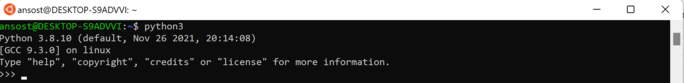

### Installation

#### Windows Sub-system Linux (WSL)
Click the Windows logo on the bottom left and search for "Turn Windows features on or off".
Check the box on "Virtual Machine Platform" and "Windows Subsystem for Linux", you will then be asked to restart your device.


Search for the "command prompt" by clicking the windows symbol at the bottom left and entering it in the search bar.
Then right click onto it and choose open as administrator.

Install WSL 2 by typing the line below in your command prompt and hitting enter.

```shell
wsl --install 
```
Download Ubuntu from the Microsoft Store (see picture).


After the download is finished start Ubuntu by clicking "Open" (see picture).

You'll be asked to create a username and password (it's being typed eventhough you are not seeing it, just hit Enter and you'll have to confirm it a second time).

In Ubuntu: type the first line and hit enter, then do the same for the second one

```
sudo apt update
sudo apt upgrade 
```

#### Python

Open Ubuntu, type the line below and hit Enter:

``` 
sudo apt install python3
sudo apt install python3-dev
sudo apt install python3-pip
```

Check whether python is installed by typing the line below and hitting enter. 

```shell
python3
```




#### Jupyter Notebook

Install Jupyter by typing the line below and hitting enter. 

```shell
pip install jupyter
```

Open bashrc using Nano editor

```shell
nano ~/.bashrc
```

Create alias to be able to start Jupyter Notebook from WSL by typing the line below and hitting enter.

```shell
alias jupyter notebook="~/.local/bin/jupyter-notebook --no-browser"
```


Next you have to Press Ctrl + X and type Y for Yes and press Enter which will take you back to your bash shell.


The output should look like the picture below. Copy paste one of the red bracketed links into the browser to use Jupyter Notebook.


You can terminate the session by clicking "Quit" at the top right in Jupyter Notebook, typing 
in Ubuntu or hitting ctrl + y and then typing "y" followed by Enter.
